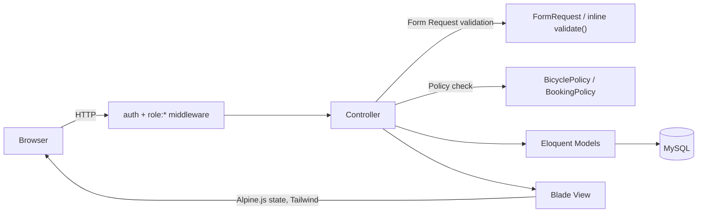
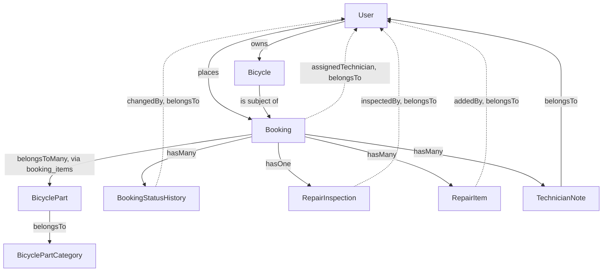
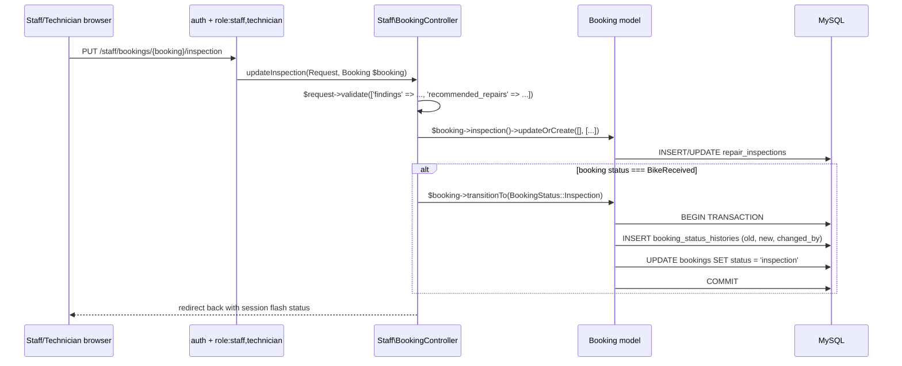
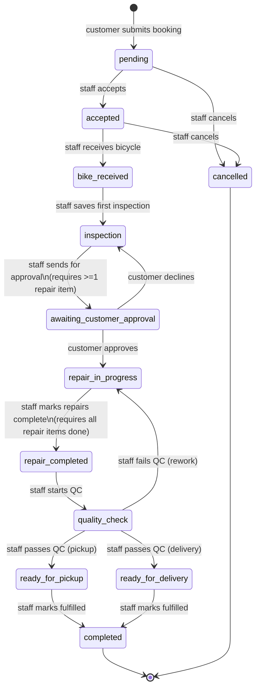

# Architecture — Bicycle Workshop Management App

This document describes the actual, current architecture of the application as implemented on branch `claude/bicycle-workshop-app-6mp087` (commit `6bfc49e`). All diagrams reflect real code — models, relationships, and controller actions that exist and are exercised by the test suite — not a target design.

---

## 1. Application Architecture

Standard Laravel monolith. No API layer, no queues in active use (config present, unused), no service/repository layer, no event/listener architecture beyond Laravel's own `Registered` auth event. Business logic lives in controllers and one model method (`Booking::transitionTo()`). Views are server-rendered Blade with Alpine.js for client-side state (the booking wizard, modals) and Tailwind for styling.



---

## 2. Laravel Structure (what's actually present)

```
app/
  Enums/            UserRole, BookingStatus (both PHP backed enums)
  Http/
    Controllers/
      Auth/          Breeze-scaffolded, standard
      Customer/      BikeController, HomeController, RepairController
      Staff/         BookingController, DashboardController, JobController
      Controller.php Base class — adds AuthorizesRequests trait (not present by default
                     in this Laravel skeleton; added manually so $this->authorize()
                     works in controllers)
      ProfileController.php   Breeze default
    Middleware/
      EnsureUserHasRole.php   The only custom middleware in the app
    Requests/
      Auth/LoginRequest.php   Breeze default
      BicycleRequest.php
      BookingRequest.php
      ProfileUpdateRequest.php  Breeze default
  Models/            9 models (see §4)
  Policies/          BicyclePolicy, BookingPolicy (auto-discovered, not registered explicitly)
  Providers/
    AppServiceProvider.php   Empty — no custom bindings/singletons
  View/Components/
    AppLayout.php, GuestLayout.php   Breeze default layout components
```

**What does not exist:** no `app/Services/`, no `app/Repositories/`, no `app/Traits/`, no `app/Jobs/` (beyond the framework's own queue tables, unused), no `app/Events/`/`app/Listeners/` beyond Breeze's built-in `Registered` event usage, no `app/Notifications/`, no API controllers, no Gates defined in `AppServiceProvider` (authorization is 100% middleware + the two policies above).

---

## 3. Important Models

| Model | Table | Key relationships |
|---|---|---|
| `User` | `users` | `hasMany` Bicycle, `hasMany` Booking |
| `Bicycle` | `bicycles` | `belongsTo` User, `belongsTo` BicycleType |
| `BicycleType` | `bicycle_types` | `hasMany` Bicycle |
| `BicyclePartCategory` | `bicycle_part_categories` | `hasMany` BicyclePart |
| `BicyclePart` | `bicycle_parts` | `belongsTo` BicyclePartCategory |
| `Booking` | `bookings` | `belongsTo` User, `belongsTo` Bicycle, `belongsTo` User as `assignedTechnician`, `belongsToMany` BicyclePart (via `booking_items`), `hasMany` BookingStatusHistory, `hasOne` RepairInspection, `hasMany` RepairItem, `hasMany` TechnicianNote |
| `BookingStatusHistory` | `booking_status_histories` | `belongsTo` Booking, `belongsTo` User as `changedBy` |
| `RepairInspection` | `repair_inspections` | `belongsTo` Booking, `belongsTo` User as `inspectedBy` |
| `RepairItem` | `repair_items` | `belongsTo` Booking, `belongsTo` User as `addedBy` |
| `TechnicianNote` | `technician_notes` | `belongsTo` Booking, `belongsTo` User |

`Booking` is the central entity — every other domain table (inspection, repair items, notes, status history) hangs directly off it. There is no separate "RepairJob" or "WorkOrder" entity; the `Booking` record itself *is* the job, and its `status` column tracks it through the entire lifecycle from initial request to completion.



---

## 4. Request Flow (example: staff records an inspection)



This pattern — validate in the controller, write the domain data, then conditionally call `Booking::transitionTo()` inside its own DB transaction — is used consistently by every staff/customer action that changes booking status.

---

## 5. Authentication / Authorization Flow

```mermaid
flowchart TD
    Request --> AuthMW{"auth middleware:\nsession present?"}
    AuthMW -->|no| Login[redirect to /login]
    AuthMW -->|yes| RoleMW{"role:X,Y middleware:\nuser.role in list?"}
    RoleMW -->|no| Forbidden["403 Forbidden"]
    RoleMW -->|yes| RouteHandler[Controller action]
    RouteHandler --> PolicyCheck{"route-model bound?\n$this->authorize() called?"}
    PolicyCheck -->|owns resource| Proceed[Execute action]
    PolicyCheck -->|does not own| Forbidden
    PolicyCheck -->|no policy check needed\n(e.g. staff area)| Proceed
```

Two independent authorization layers exist and are both real (not just one or the other):
1. **Role middleware** (coarse-grained): which *area* of the app (`/customer/*` vs `/staff/*`) a user may enter at all.
2. **Ownership policies** (fine-grained, customer side only): within `/customer/*`, whether *this specific* bicycle/booking belongs to the logged-in user. There is no equivalent fine-grained check within `/staff/*` — any staff/technician can act on any booking (see `docs/PROJECT_STATUS.md` §6 for why this is a documented decision, not an oversight).

---

## 6. Main Business Entities

- **User** — one of three roles (`customer`, `staff`, `technician`); no `admin` role exists.
- **Bicycle** — owned by exactly one customer; has a type and free-form descriptive fields.
- **Booking** — the core entity. Created by a customer against one of their own bicycles, referencing one or more `BicyclePart`s (the reported problem areas) and carrying the entire lifecycle state machine described below.
- **RepairInspection** — one-to-one with a Booking; staff's findings and recommended repairs.
- **RepairItem** — many per Booking; the concrete, trackable list of repair tasks (independently completable).
- **TechnicianNote** — many per Booking; free-form internal communication log.
- **BookingStatusHistory** — many per Booking; the audit trail of every status change, who made it, and when.

---

## 7. Repair Workflow Architecture

The workflow is implemented as a **string-backed enum** (`App\Enums\BookingStatus`) plus **scattered per-action guard clauses** across two controllers (`Staff\BookingController`, `Customer\RepairController`) — there is no single declarative state machine class or transition table in the codebase. Every transition funnels through the same model method, `Booking::transitionTo(BookingStatus $status)`, which is the one piece of shared, reusable workflow logic:

```php
// app/Models/Booking.php
public function transitionTo(BookingStatus $status): void
{
    DB::transaction(function () use ($status): void {
        $this->statusHistories()->create([
            'old_status' => $this->status,
            'new_status' => $status,
            'changed_by' => Auth::id(),
        ]);
        $this->status = $status;   // direct assignment — status is not mass-assignable
        $this->save();
    });
}
```

### Full transition diagram (as actually implemented and tested)



`scheduled` exists as an enum case (with a label and a badge color) but is never set by any code path — it is not part of the diagram above because it is not a reachable state.

### Guard conditions per transition (who can trigger it, and what blocks it)

| Transition | Trigger | Guard |
|---|---|---|
| → `pending` | Customer submits booking wizard | Bicycle must belong to the submitting customer; at least one part selected; appointment date ≥ today |
| `pending` → `accepted` | Staff clicks Accept | Current status must be `pending` |
| `pending`/`accepted` → `cancelled` | Staff clicks Cancel | Current status must be `pending` or `accepted` |
| `accepted` → `bike_received` | Staff clicks Receive Bicycle | Current status must be `accepted` |
| `bike_received` → `inspection` | Staff saves inspection form | Only fires on the *first* save while status is exactly `bike_received`; later inspection edits don't re-fire it |
| `inspection` → `awaiting_customer_approval` | Staff clicks Send for Customer Approval | Current status must be `inspection`; booking must have ≥1 repair item |
| `awaiting_customer_approval` → `repair_in_progress` | Customer clicks Approve | Must be the booking's owner; current status must be `awaiting_customer_approval` |
| `awaiting_customer_approval` → `inspection` | Customer clicks Decline | Same guards as Approve |
| `repair_in_progress` → `repair_completed` | Staff clicks Mark Repairs Completed | Current status must be `repair_in_progress`; every repair item's `completed_at` must be set (and at least one must exist) |
| `repair_completed` → `quality_check` | Staff clicks Start Quality Check | Current status must be `repair_completed` |
| `quality_check` → `ready_for_pickup`/`ready_for_delivery` | Staff clicks Pass | Current status must be `quality_check`; `fulfillment_method` ∈ {pickup, delivery} |
| `quality_check` → `repair_in_progress` | Staff clicks Fail | Current status must be `quality_check` |
| `ready_for_pickup`/`ready_for_delivery` → `completed` | Staff clicks Mark Picked Up/Delivered | Current status must be one of those two |

Every row above is backed by a passing feature test (both the happy path and the "guard rejects it" path).

---

## 8. Frontend Architecture

- **Layouts:** `resources/views/layouts/app.blade.php` (authenticated shell: header with app name + logout, optional `$header` slot, `<main>`, fixed bottom nav) and `layouts/guest.blade.php` (Breeze default, used only for auth screens). There is **one shared layout for all authenticated users** — customer and staff/technician views share `<x-app-layout>`; the only per-role difference is which items `<x-bottom-nav>` renders (computed from `$user->isWorkshopUser()`), not a separate layout file.
- **Reusable Blade components** (`resources/views/components/`): `page-header`, `empty-state`, `status-badge` (color-codes all 13 `BookingStatus` values), `bottom-nav`, plus Breeze's form/UI primitives (`modal`, `text-input`, `input-label`, `input-error`, `primary-button`, `secondary-button`, `danger-button`, `dropdown`, `dropdown-link`, `nav-link`, `responsive-nav-link`, `application-logo`, `auth-session-status`). One partial exists outside `components/`: `customer/bikes/_form.blade.php`, shared between the create and edit bicycle screens.
- **Alpine.js usage:** two real, non-trivial uses — the 5-step repair-booking wizard (`customer/repairs/create.blade.php`, entirely client-side step/validation state via `x-data`) and Breeze's modal component (used for "Cancel Booking" and "Decline Repairs" confirmations). Elsewhere Alpine is used minimally (e.g. `x-data=""` just to scope a `$dispatch('open-modal', ...)` call).
- **Tailwind:** utility-first throughout, no custom component classes beyond what's inlined in Blade; `@tailwindcss/forms` plugin is active (affects default form control styling).
- **Navigation structure:** a single fixed bottom nav bar, 4 items, role-aware — Customer: Home/Repairs/Bikes/Profile; Staff/Technician: Dashboard/Bookings/Jobs/Profile.

**Duplicated UI code observed (not refactored, per audit scope):** the "booking summary card" pattern (bicycle nickname + reference number + status badge in a bordered rounded card, used as a list-item link) is repeated near-verbatim across `customer/home.blade.php`, `customer/repairs/index.blade.php`, `staff/dashboard.blade.php`, `staff/bookings/index.blade.php`, and `staff/jobs/index.blade.php` — five separate copies of essentially the same markup. This would be a reasonable candidate for a `<x-booking-card>` component in a future cleanup pass, but was left as-is here per the audit's no-refactor rule.

---

## 9. Mobile-First Status

Classification: **Good**, with minor caveats.

- The entire app is built inside a `max-w-2xl` centered container with no desktop-specific breakpoints anywhere in the Blade templates — it is, in effect, mobile-only chrome that happens to also render acceptably on desktop (centered, not full-width).
- Primary navigation is a fixed bottom tab bar (`pb-[env(safe-area-inset-bottom)]` — explicitly accounts for iOS safe-area insets), not a desktop-style top nav or sidebar.
- All list views use card-based layouts (rounded bordered `div`s), never HTML `<table>` elements — nothing to worry about for narrow viewports.
- Primary actions are consistently large, full-width, thumb-friendly buttons (`px-5 py-3` at minimum).
- The repair-booking wizard is explicitly step-based specifically to avoid a single long scrolling form on a small screen.
- Forms use appropriate input types (`type="date"`, `type="number"`) to get native mobile pickers.

**Caveats:** the staff `booking show` page (the largest view in the app, with technician assignment, inspection form, repair items, notes, and up to 6 workflow-transition buttons all on one page) is long — functional and still card/section-based, but a lot of vertical scrolling on a phone. No explicit desktop layout adaptation exists (e.g. no multi-column layout at wider breakpoints) — this appears to be an intentional simplicity choice consistent with "mobile-first, avoid over-engineering" rather than an oversight, since the app was never asked to also excel on desktop.
