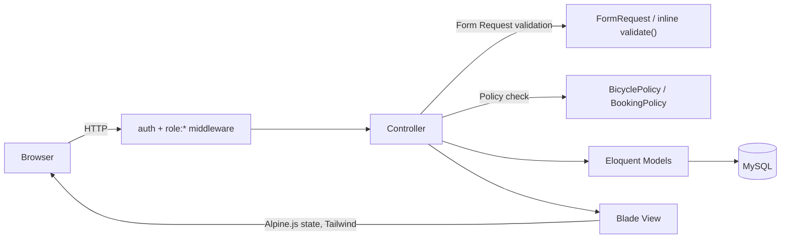
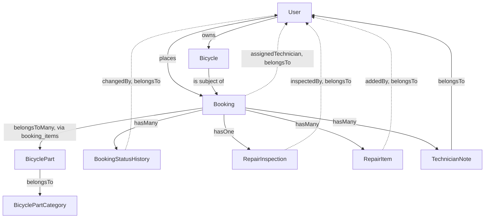
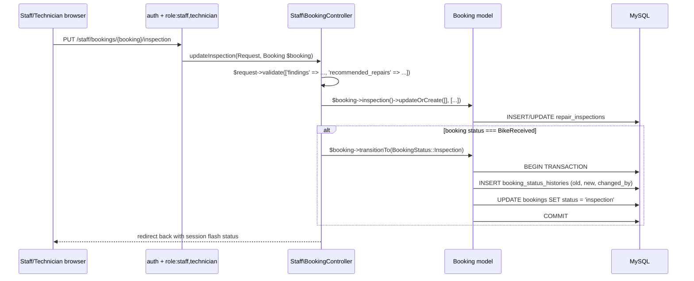
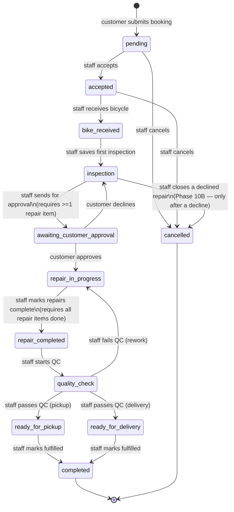
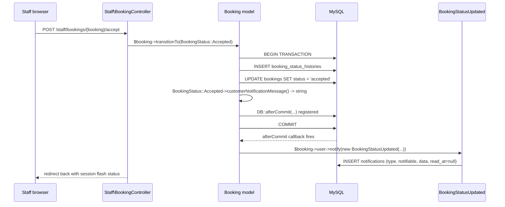
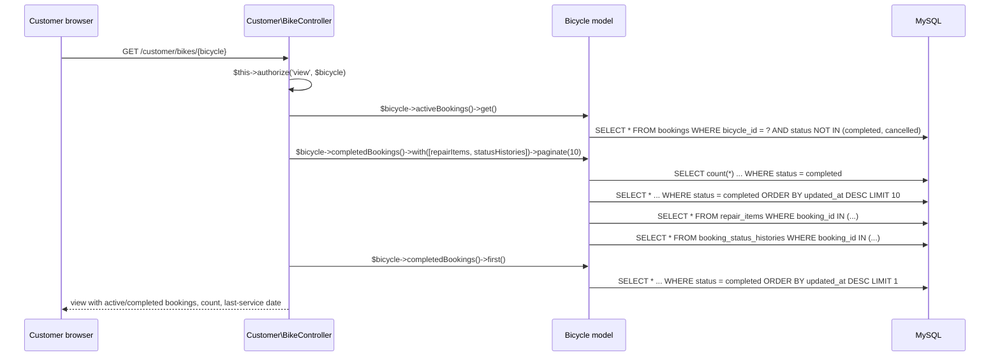
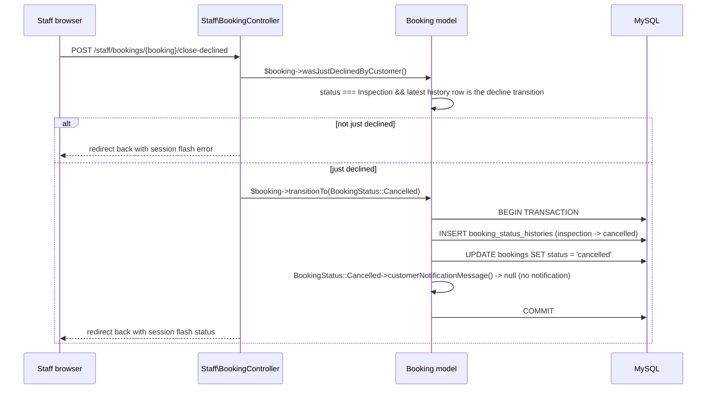

# Architecture — Bicycle Workshop Management App

This document describes the actual, current architecture of the application as implemented on branch `claude/bicycle-workshop-app-6mp087` (commit `6bfc49e`), updated for Phase 7 (Customer Repair Tracking + Staff Dashboard Fix), Phase 8 (In-App Notifications), Phase 9 (Bicycle Service & Repair History), and **updated for Phase 10B** (V1 Release Hardening). All diagrams reflect real code — models, relationships, and controller actions that exist and are exercised by the test suite — not a target design. Phase 7 added no new tables, models, routes, or architectural layers; it is purely additive within the existing MVC structure — see §10 below for what changed. Phase 8 added one table (`notifications`, Laravel's standard schema), one model-adjacent notification class, one controller, and three routes — see §11 below. Phase 9 added **no new table, model, route, policy, or controller** — it added three relations to `Bicycle`, one helper method to `Booking`, and extended two existing controller actions/views — see §12 below. Phase 10A (2026-09-21) was an audit-only phase (no code changes) — see `docs/PROJECT_STATUS.md` §24 for its findings. Phase 10B (2026-09-21) added **no new table, model, or policy** — one new route/controller action, one new seeder class, two new enum/model helper methods, and hardening changes to two existing controllers and their views — see §13 below.

---

## 1. Application Architecture

Standard Laravel monolith. No API layer, no queues in active use (config present, unused), no service/repository layer, no event/listener architecture beyond Laravel's own `Registered` auth event. Business logic lives in controllers and one model method (`Booking::transitionTo()`). Views are server-rendered Blade with Alpine.js for client-side state (the booking wizard, modals) and Tailwind for styling.



---

## 2. Laravel Structure (what's actually present)

```
app/
  Enums/            UserRole, BookingStatus (both PHP backed enums)
  Http/
    Controllers/
      Auth/          Breeze-scaffolded, standard
      Customer/      BikeController, HomeController, RepairController
      Staff/         BookingController, DashboardController, JobController
      Controller.php Base class — adds AuthorizesRequests trait (not present by default
                     in this Laravel skeleton; added manually so $this->authorize()
                     works in controllers)
      ProfileController.php   Breeze default
    Middleware/
      EnsureUserHasRole.php   The only custom middleware in the app
    Requests/
      Auth/LoginRequest.php   Breeze default
      BicycleRequest.php
      BookingRequest.php
      ProfileUpdateRequest.php  Breeze default
  Models/            9 models (see §4)
  Policies/          BicyclePolicy, BookingPolicy (auto-discovered, not registered explicitly)
  Providers/
    AppServiceProvider.php   Empty — no custom bindings/singletons
  View/Components/
    AppLayout.php, GuestLayout.php   Breeze default layout components
```

**What does not exist:** no `app/Services/`, no `app/Repositories/`, no `app/Traits/`, no `app/Jobs/` (beyond the framework's own queue tables, unused), no `app/Events/`/`app/Listeners/` beyond Breeze's built-in `Registered` event usage, no API controllers, no Gates defined in `AppServiceProvider` (authorization is 100% middleware + the two policies above). **As of Phase 8**, `app/Notifications/` exists with one class, `BookingStatusUpdated` (database-channel only) — see §11.

---

## 3. Important Models

| Model | Table | Key relationships |
|---|---|---|
| `User` | `users` | `hasMany` Bicycle, `hasMany` Booking, `morphMany` `Illuminate\Notifications\DatabaseNotification` (via the `Notifiable` trait — `notifications()`/`unreadNotifications()`, Phase 8) |
| `Bicycle` | `bicycles` | `belongsTo` User, `belongsTo` BicycleType, `hasMany` Booking (`bookings()`, plus the derived `completedBookings()`/`activeBookings()` — Phase 9, see §12) |
| `BicycleType` | `bicycle_types` | `hasMany` Bicycle |
| `BicyclePartCategory` | `bicycle_part_categories` | `hasMany` BicyclePart |
| `BicyclePart` | `bicycle_parts` | `belongsTo` BicyclePartCategory |
| `Booking` | `bookings` | `belongsTo` User, `belongsTo` Bicycle, `belongsTo` User as `assignedTechnician`, `belongsToMany` BicyclePart (via `booking_items`), `hasMany` BookingStatusHistory, `hasOne` RepairInspection, `hasMany` RepairItem, `hasMany` TechnicianNote |
| `BookingStatusHistory` | `booking_status_histories` | `belongsTo` Booking, `belongsTo` User as `changedBy` |
| `RepairInspection` | `repair_inspections` | `belongsTo` Booking, `belongsTo` User as `inspectedBy` |
| `RepairItem` | `repair_items` | `belongsTo` Booking, `belongsTo` User as `addedBy` |
| `TechnicianNote` | `technician_notes` | `belongsTo` Booking, `belongsTo` User |

`Booking` is the central entity — every other domain table (inspection, repair items, notes, status history) hangs directly off it. There is no separate "RepairJob" or "WorkOrder" entity; the `Booking` record itself *is* the job, and its `status` column tracks it through the entire lifecycle from initial request to completion.



---

## 4. Request Flow (example: staff records an inspection)



This pattern — validate in the controller, write the domain data, then conditionally call `Booking::transitionTo()` inside its own DB transaction — is used consistently by every staff/customer action that changes booking status.

---

## 5. Authentication / Authorization Flow

```mermaid
flowchart TD
    Request --> AuthMW{"auth middleware:\nsession present?"}
    AuthMW -->|no| Login[redirect to /login]
    AuthMW -->|yes| RoleMW{"role:X,Y middleware:\nuser.role in list?"}
    RoleMW -->|no| Forbidden["403 Forbidden"]
    RoleMW -->|yes| RouteHandler[Controller action]
    RouteHandler --> PolicyCheck{"route-model bound?\n$this->authorize() called?"}
    PolicyCheck -->|owns resource| Proceed[Execute action]
    PolicyCheck -->|does not own| Forbidden
    PolicyCheck -->|no policy check needed\n(e.g. staff area)| Proceed
```

Two independent authorization layers exist and are both real (not just one or the other):
1. **Role middleware** (coarse-grained): which *area* of the app (`/customer/*` vs `/staff/*`) a user may enter at all.
2. **Ownership policies** (fine-grained, customer side only): within `/customer/*`, whether *this specific* bicycle/booking belongs to the logged-in user. There is no equivalent fine-grained check within `/staff/*` — any staff/technician can act on any booking (see `docs/PROJECT_STATUS.md` §6 for why this is a documented decision, not an oversight).

---

## 6. Main Business Entities

- **User** — one of three roles (`customer`, `staff`, `technician`); no `admin` role exists.
- **Bicycle** — owned by exactly one customer; has a type and free-form descriptive fields.
- **Booking** — the core entity. Created by a customer against one of their own bicycles, referencing one or more `BicyclePart`s (the reported problem areas) and carrying the entire lifecycle state machine described below.
- **RepairInspection** — one-to-one with a Booking; staff's findings and recommended repairs.
- **RepairItem** — many per Booking; the concrete, trackable list of repair tasks (independently completable).
- **TechnicianNote** — many per Booking; free-form internal communication log.
- **BookingStatusHistory** — many per Booking; the audit trail of every status change, who made it, and when.

---

## 7. Repair Workflow Architecture

The workflow is implemented as a **string-backed enum** (`App\Enums\BookingStatus`) plus **scattered per-action guard clauses** across two controllers (`Staff\BookingController`, `Customer\RepairController`) — there is no single declarative state machine class or transition table in the codebase. Every transition funnels through the same model method, `Booking::transitionTo(BookingStatus $status)`, which is the one piece of shared, reusable workflow logic:

```php
// app/Models/Booking.php
public function transitionTo(BookingStatus $status): void
{
    DB::transaction(function () use ($status): void {
        $this->statusHistories()->create([
            'old_status' => $this->status,
            'new_status' => $status,
            'changed_by' => Auth::id(),
        ]);
        $this->status = $status;   // direct assignment — status is not mass-assignable
        $this->save();

        // Phase 8: the same funnel every transition already goes through is
        // also the one reliable place to notify the customer. Deferred to
        // DB::afterCommit() so a rolled-back transition never leaves a
        // stray notification behind. See BookingStatus::customerNotificationMessage()
        // for which statuses actually notify (most don't).
        if ($message = $status->customerNotificationMessage()) {
            DB::afterCommit(fn () => $this->user->notify(
                new BookingStatusUpdated($this->id, $this->reference_number, $status, $message)
            ));
        }
    });
}
```

### Full transition diagram (as actually implemented and tested)



`scheduled` exists as an enum case (with a label and a badge color) but is never set by any code path — it is not part of the diagram above because it is not a reachable state.

**Phase 10B** added the `inspection --> cancelled` edge: `Staff\BookingController::closeDeclinedRepair()` lets staff close a booking the customer declined (no repair performed) rather than leaving it stuck in `inspection` indefinitely. It reuses `cancelled` rather than a new status — see `docs/PROJECT_STATUS.md` §25.5 for the full reasoning — and is only reachable when `Booking::wasJustDeclinedByCustomer()` is true (current status `inspection`, most recent status-history row is specifically the `awaiting_customer_approval → inspection` decline). `Booking::wasCancelledAfterCustomerDecline()` is how views tell this apart from the pre-existing `pending`/`accepted → cancelled` early cancellation, since `inspection → cancelled` is the only transition that path can ever produce.

Also **Phase 10B**: every transition into `completed`/`cancelled` is now a hard stop for `Staff\BookingController`'s five operational-data actions (`assignTechnician`, `updateInspection`, `storeRepairItem`, `completeRepairItem`, `storeTechnicianNote`) — `BookingStatus::isTerminal()` plus a shared `rejectIfTerminal()` guard reject all five once a booking reaches either status, server-side, regardless of what the UI shows (see `docs/PROJECT_STATUS.md` §25.4). This doesn't change the diagram above (no new status, no new transition), only which actions remain available once a booking is terminal.

### Guard conditions per transition (who can trigger it, and what blocks it)

| Transition | Trigger | Guard |
|---|---|---|
| → `pending` | Customer submits booking wizard | Bicycle must belong to the submitting customer; at least one part selected; appointment date ≥ today |
| `pending` → `accepted` | Staff clicks Accept | Current status must be `pending` |
| `pending`/`accepted` → `cancelled` | Staff clicks Cancel | Current status must be `pending` or `accepted` |
| `accepted` → `bike_received` | Staff clicks Receive Bicycle | Current status must be `accepted` |
| `bike_received` → `inspection` | Staff saves inspection form | Only fires on the *first* save while status is exactly `bike_received`; later inspection edits don't re-fire it |
| `inspection` → `awaiting_customer_approval` | Staff clicks Send for Customer Approval | Current status must be `inspection`; booking must have ≥1 repair item |
| `awaiting_customer_approval` → `repair_in_progress` | Customer clicks Approve | Must be the booking's owner; current status must be `awaiting_customer_approval` |
| `awaiting_customer_approval` → `inspection` | Customer clicks Decline | Same guards as Approve |
| `repair_in_progress` → `repair_completed` | Staff clicks Mark Repairs Completed | Current status must be `repair_in_progress`; every repair item's `completed_at` must be set (and at least one must exist) |
| `repair_completed` → `quality_check` | Staff clicks Start Quality Check | Current status must be `repair_completed` |
| `quality_check` → `ready_for_pickup`/`ready_for_delivery` | Staff clicks Pass | Current status must be `quality_check`; `fulfillment_method` ∈ {pickup, delivery} |
| `quality_check` → `repair_in_progress` | Staff clicks Fail | Current status must be `quality_check` |
| `ready_for_pickup`/`ready_for_delivery` → `completed` | Staff clicks Mark Picked Up/Delivered | Current status must be one of those two |
| `inspection` → `cancelled` (Phase 10B) | Staff clicks Close — Customer Declined Repair | `Booking::wasJustDeclinedByCustomer()` must be true (current status `inspection`, most recent status-history row is the decline transition) |

Every row above is backed by a passing feature test (both the happy path and the "guard rejects it" path). **Phase 10B** additionally guards `assignTechnician`, `updateInspection`, `storeRepairItem`, `completeRepairItem`, and `storeTechnicianNote` — none of these change `status`, but each now rejects outright (server-side, not just UI-hidden) once `$booking->status->isTerminal()` (`completed` or `cancelled`) is true.

---

## 8. Frontend Architecture

- **Layouts:** `resources/views/layouts/app.blade.php` (authenticated shell: header with app name + logout, optional `$header` slot, `<main>`, fixed bottom nav) and `layouts/guest.blade.php` (Breeze default, used only for auth screens). There is **one shared layout for all authenticated users** — customer and staff/technician views share `<x-app-layout>`; the only per-role difference is which items `<x-bottom-nav>` renders (computed from `$user->isWorkshopUser()`), not a separate layout file.
- **Reusable Blade components** (`resources/views/components/`): `page-header`, `empty-state`, `status-badge` (color-codes all 13 `BookingStatus` values), `bottom-nav`, plus Breeze's form/UI primitives (`modal`, `text-input`, `input-label`, `input-error`, `primary-button`, `secondary-button`, `danger-button`, `dropdown`, `dropdown-link`, `nav-link`, `responsive-nav-link`, `application-logo`, `auth-session-status`). One partial exists outside `components/`: `customer/bikes/_form.blade.php`, shared between the create and edit bicycle screens.
- **Alpine.js usage:** two real, non-trivial uses — the 5-step repair-booking wizard (`customer/repairs/create.blade.php`, entirely client-side step/validation state via `x-data`) and Breeze's modal component (used for "Cancel Booking" and "Decline Repairs" confirmations). Elsewhere Alpine is used minimally (e.g. `x-data=""` just to scope a `$dispatch('open-modal', ...)` call).
- **Tailwind:** utility-first throughout, no custom component classes beyond what's inlined in Blade; `@tailwindcss/forms` plugin is active (affects default form control styling).
- **Navigation structure:** a single fixed bottom nav bar, 4 items, role-aware — Customer: Home/Repairs/Bikes/Profile; Staff/Technician: Dashboard/Bookings/Jobs/Profile.

**Duplicated UI code observed (not refactored, per audit scope):** the "booking summary card" pattern (bicycle nickname + reference number + status badge in a bordered rounded card, used as a list-item link) is repeated near-verbatim across `customer/home.blade.php`, `customer/repairs/index.blade.php`, `staff/dashboard.blade.php`, `staff/bookings/index.blade.php`, and `staff/jobs/index.blade.php` — five separate copies of essentially the same markup. This would be a reasonable candidate for a `<x-booking-card>` component in a future cleanup pass, but was left as-is here per the audit's no-refactor rule.

---

## 9. Mobile-First Status

Classification: **Good**, with minor caveats.

- The entire app is built inside a `max-w-2xl` centered container with no desktop-specific breakpoints anywhere in the Blade templates — it is, in effect, mobile-only chrome that happens to also render acceptably on desktop (centered, not full-width).
- Primary navigation is a fixed bottom tab bar (`pb-[env(safe-area-inset-bottom)]` — explicitly accounts for iOS safe-area insets), not a desktop-style top nav or sidebar.
- All list views use card-based layouts (rounded bordered `div`s), never HTML `<table>` elements — nothing to worry about for narrow viewports.
- Primary actions are consistently large, full-width, thumb-friendly buttons (`px-5 py-3` at minimum).
- The repair-booking wizard is explicitly step-based specifically to avoid a single long scrolling form on a small screen.
- Forms use appropriate input types (`type="date"`, `type="number"`) to get native mobile pickers.

**Caveats:** the staff `booking show` page (the largest view in the app, with technician assignment, inspection form, repair items, notes, and up to 6 workflow-transition buttons all on one page) is long — functional and still card/section-based, but a lot of vertical scrolling on a phone. No explicit desktop layout adaptation exists (e.g. no multi-column layout at wider breakpoints) — this appears to be an intentional simplicity choice consistent with "mobile-first, avoid over-engineering" rather than an oversight, since the app was never asked to also excel on desktop.

---

## 10. Phase 7 — Customer Repair Tracking + Staff Dashboard Fix

Phase 7 is additive/fix-oriented: no new tables, models, routes, middleware, or policies. Two existing pieces of the app were extended.

### 10.1 Customer repair tracking (`customer.repairs.show`)

`Customer\RepairController::show()` now eager-loads `bicycle.bicycleType`, `bicycleParts.bicyclePartCategory`, `inspection`, `repairItems`, and `statusHistories` (previously: `bicycle`, `bicycleParts.bicyclePartCategory`, `inspection`, `repairItems` — `statusHistories` and `bicycle.bicycleType` are the only additions). The `$this->authorize('view', $booking)` call — the existing `BookingPolicy::view` ownership check — is unchanged; Phase 7 relies on it rather than adding a second authorization mechanism.

`resources/views/customer/repairs/show.blade.php` builds its **repair timeline** entirely from `$booking->statusHistories` (the same `Booking::statusHistories(): HasMany` relationship the staff booking-show page already used) plus one synthetic first entry ("Booking Submitted", timestamped `$booking->created_at`) to cover the fact that a booking's initial `pending` status is set directly in `Booking::booted()` rather than via `transitionTo()`, so no `booking_status_histories` row exists for it — the same gap the staff view papers over with its own hardcoded "Booking Received" first entry. Every subsequent timeline entry is a real, unmodified history row rendered with the existing `BookingStatus::label()` — no new labels, no fabricated timestamps, no deduplication (a quality-check rework loop shows every real pass through `quality_check`/`repair_in_progress`/`repair_completed`).

The rest of the page's new sections (inspection findings/recommended work, itemized proposed repairs with per-item completed/pending state, an "approved on {date}" note derived from the specific `awaiting_customer_approval → repair_in_progress` history row, and contextual quality-check/ready-for-pickup/ready-for-delivery/completed banners) are all computed in a `@php` block at the top of the view from `$booking`'s already-loaded relationships — no controller changes beyond the eager-load list above, no new Eloquent queries per section. The existing "shareable statuses" gate (inspection/repair-item info only visible once staff have sent the booking for approval) is unchanged from the pre-Phase-7 behavior.

### 10.2 Staff dashboard fix (`staff.dashboard`)

`Staff\DashboardController::index()` already ran one grouped query (`Booking::query()->selectRaw('status, count(*) as count')->groupBy('status')->pluck('count', 'status')`) and a `$countFor(BookingStatus $status)` closure over it, but only used that closure for three of the ten non-terminal statuses (`Pending`, `Accepted`, `BikeReceived`) — the view hardcoded the other four tiles to `0`. Phase 7 extends the same closure to the remaining tiles (`awaitingApprovalCount`, `inRepairCount`, `qualityCheckCount`, and `readyCount` — the last summing `ReadyForPickup` + `ReadyForDelivery`, since the UI has always had one combined "Ready" tile for both fulfillment methods) and passes them to the view, which now renders them instead of literal `0`s. No new query was added — the existing single grouped query already had every status's count available; it just wasn't being read.

---

## 11. Phase 8 — In-App Notifications

Phase 8 adds one table, one notification class, one controller, and three routes — the smallest architectural footprint of any phase so far, deliberately, per the phase's "keep it simple" brief. See `docs/PROJECT_STATUS.md` §22 for the full write-up (which statuses notify and why, payload contents, manual verification); this section covers structure/placement only.

### 11.1 New pieces

```
app/
  Enums/
    BookingStatus.php          + customerNotificationMessage(): ?string
  Models/
    Booking.php                transitionTo() now dispatches a notification after commit
  Notifications/                 NEW directory
    BookingStatusUpdated.php   database-channel notification (booking_id, reference number, status, message)
  Http/Controllers/Customer/
    NotificationController.php NEW — index/read/readAll
database/migrations/
  2026_09_20_000001_create_notifications_table.php   Laravel's standard notifications table
resources/views/customer/notifications/
  index.blade.php              NEW
resources/views/components/
  bottom-nav.blade.php         customer nav gained a 5th item ("Alerts") with an unread-count badge
```

No new model was added — `App\Models\User` already had `use Notifiable` (from the Breeze scaffold, previously exercised only by email verification) and needed no change to gain `notifications()`/`unreadNotifications()`/`notify()`. No new policy was added; ownership is enforced by query-scoping through the authenticated user rather than a `NotificationPolicy` ability check (see PROJECT_STATUS.md §22.3 for why that's sufficient here).

### 11.2 Routes

Three new routes, inside the existing `auth`/`role:customer` group (`routes/web.php`):

| Method | URL | Name | Controller@action |
|---|---|---|---|
| GET | `/customer/notifications` | `customer.notifications.index` | `NotificationController@index` |
| POST | `/customer/notifications/read-all` | `customer.notifications.read-all` | `NotificationController@readAll` |
| POST | `/customer/notifications/{notification}/read` | `customer.notifications.read` | `NotificationController@read` |

`{notification}` is a plain route parameter (the notification's UUID string), not an Eloquent route-model binding — `read()` resolves it via `$request->user()->notifications()->findOrFail($notification)` instead, which is what makes cross-customer access 404 rather than requiring a separate authorization check (see PROJECT_STATUS.md §22.3).

### 11.3 Request flow (example: staff accepts a booking, customer gets notified)



This is the only place in the codebase a notification is created — no controller calls `notify()` directly, which is what keeps every current and future transition-triggering action automatically notification-consistent (the failure mode the phase's brief explicitly wanted to avoid: "Controller A changes status + sends notification, Controller B changes status + forgets notification").

---

## 12. Phase 9 — Bicycle Service & Repair History

Phase 9 adds a bicycle's derived service history to the existing customer bicycle page and staff booking page. No new table, model, route, policy, or controller — the smallest architectural footprint of any phase so far (even smaller than Phase 8's), because the requirement was explicitly to present existing data, not to build a new subsystem for it. See `docs/PROJECT_STATUS.md` §23 for the full write-up (exact fields shown, authorization detail, manual verification); this section covers structure/placement only.

### 12.1 New pieces

```
app/
  Models/
    Bicycle.php   + bookings(): HasMany
                  + completedBookings(): HasMany  (status = Completed, newest first)
                  + activeBookings(): HasMany      (status not in [Completed, Cancelled])
    Booking.php   + fulfillmentMethod(): ?BookingStatus  (derived from statusHistories)
  Http/Controllers/
    Customer/BikeController.php     show() now also loads activeBookings/completedBookings
    Staff/BookingController.php     show() now also loads previousRepairs for the bicycle
resources/views/
  customer/bikes/show.blade.php     + Current Repair(s) / Service History / Previous Service History
  staff/bookings/show.blade.php     + Previous Repairs for This Bicycle
```

No migration, no new Eloquent model, no new policy, no new route. `BicyclePolicy::view` and `BookingPolicy::view` (both unchanged) are what gate the new data — see `docs/PROJECT_STATUS.md` §23.4.

### 12.2 Why relations on `Bicycle`, not a query built inline per controller

`completedBookings()`/`activeBookings()` are defined once on `Bicycle` (rather than as ad-hoc `Booking::where(...)` queries duplicated in both `Customer\BikeController` and `Staff\BookingController`) because both controllers need the identical "completed repairs for this bicycle, newest first" query. This mirrors the existing pattern of putting shared, reusable query logic on the model that owns the relationship (e.g. `Booking::statusHistories()`, already reused by both the staff and customer booking-detail views since Phase 7) rather than introducing a service/repository layer the rest of the app deliberately doesn't have (`docs/ARCHITECTURE.md` §1/§2).

### 12.3 Request flow (example: customer opens a bicycle with service history)



A fixed, small number of queries regardless of how many completed bookings the bicycle has (bounded by the page size) — see `docs/PROJECT_STATUS.md` §23.6 for the equivalent staff-side query shape and the reasoning against N+1.

---

## 13. Phase 10B — V1 Release Hardening

Phase 10B added **no new table, model, or policy**. See `docs/PROJECT_STATUS.md` §25 for the full write-up (problem, fix, why a migration was avoided, tests, for each of the five items below); this section covers structure/placement only.

### 13.1 New pieces

```
app/
  Enums/
    BookingStatus.php          + isTerminal(): bool
  Models/
    Booking.php                + wasJustDeclinedByCustomer(): bool
                                + wasCancelledAfterCustomerDecline(): bool
    User.php                   + technicianNotes(): HasMany
  Http/Controllers/
    ProfileController.php      destroy() now rejects customer self-deletion
                                and staff/technician deletion when
                                technician notes exist, before ever
                                reaching $user->delete()
    Staff/BookingController.php + closeDeclinedRepair()
                                + rejectIfTerminal() (private guard, called
                                  by 5 existing actions)
database/seeders/
  DemoAccountSeeder.php         NEW — the three demo-account blocks moved
                                 out of DatabaseSeeder, gated by
                                 shouldRun(string $environment): bool
  DatabaseSeeder.php             only calls DemoAccountSeeder::class when
                                 shouldRun() says so
routes/web.php
  + POST /staff/bookings/{booking}/close-declined  (staff.bookings.close-declined)
resources/views/
  profile/partials/delete-user-form.blade.php   role-conditional now
  staff/bookings/show.blade.php                 terminal read-only mode,
                                                  new close-declined action,
                                                  cancelled-state messaging
  customer/repairs/show.blade.php               declined-and-closed
                                                  messaging + shareable gate
```

No migration, no new Eloquent model, no new policy. `BicyclePolicy`/`BookingPolicy` (both unchanged) continue to gate everything they already gated; the new restrictions in §25.1/§25.2 are enforced in `ProfileController` directly (there is no `UserPolicy` in this app — see §2), consistent with how the rest of the codebase keeps authorization logic close to the controller action it protects rather than introducing a policy class for a single self-service action.

### 13.2 Why controller-level guards, not new migrations

Both database-adjacent Phase 10A findings (§25.1's `technician_notes.user_id` FK, §25.2's `bicycles`/`bookings` cascade) were fixed without touching the schema:
- §25.1 could have used `nullOnDelete()` on `technician_notes.user_id` (matching `changed_by`/`inspected_by`/`added_by`), but that requires altering an existing NOT-NULL foreign-key column on the production MySQL database — real migration risk for a fix a controller check achieves with none, and the approved scope explicitly offered this exact fallback.
- §25.2 could have redesigned the `User`-to-`Booking`/`Bicycle` ownership/cascade relationship (e.g. anonymize-on-delete), but that's a genuine product decision about what "delete my account" should mean for a workshop's own records, explicitly out of scope for this phase.

This keeps Phase 10B's database footprint identical to Phase 9's: zero migrations, same as the "avoid migrations unless genuinely required" instruction each phase since Phase 9 has followed.

### 13.3 Request flow (example: staff closes a declined repair)



Same funnel as every other transition in the app (§7) — no special-cased status write, no bypass of the audit trail.
