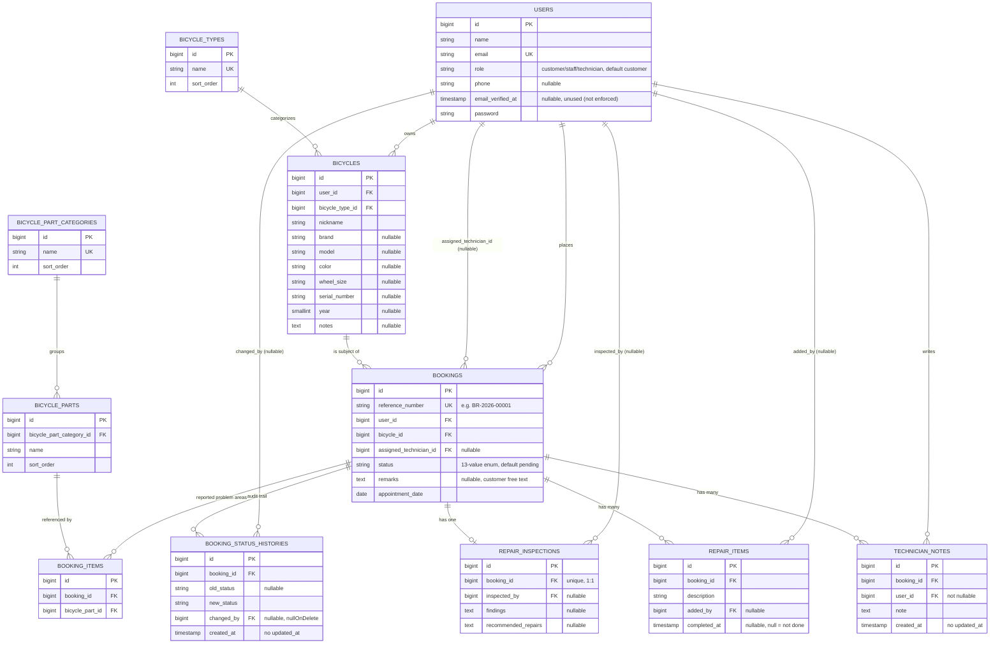

# Database — Bicycle Workshop Management App

Derived directly from the 15 migration files in `database/migrations/` (3 Laravel framework migrations + 12 application migrations) and confirmed by running `php artisan migrate:fresh` end-to-end against a disposable SQLite database during this audit — all 15 ran cleanly, no conflicts, no obsolete/duplicated migrations found.

All tables use MySQL (via the project's Docker Compose setup — see `docs/PROJECT_STATUS.md` §3) via Laravel's default `bigint unsigned auto_increment` primary key (`$table->id()`) and `timestamps()` (`created_at`/`updated_at`) unless noted otherwise.

---

## Entity-Relationship Diagram

Only tables that actually exist are shown. Framework infrastructure tables (`cache`, `cache_locks`, `jobs`, `job_batches`, `failed_jobs`, `sessions`, `password_reset_tokens`) are omitted for clarity — they exist (standard Laravel) but carry no application logic.

---

## Table-by-Table Detail

### `users`
**Purpose:** every human account — customers, staff, and technicians share one table, distinguished by `role`.
- Migrations: `0001_01_01_000000_create_users_table.php` (base Laravel Breeze table) + `2026_08_18_100803_add_role_and_phone_to_users_table.php` (adds `role`, `phone`).
- Key columns: `name`, `email` (unique), `password` (hashed), `role` (string, default `'customer'`, indexed), `phone` (nullable), `email_verified_at` (nullable — present but not functionally enforced anywhere, see PROJECT_STATUS §5).
- No foreign keys (this is the root entity).
- Cast on the model to `App\Enums\UserRole` (`Customer`/`Staff`/`Technician`).

### `bicycle_types`
**Purpose:** seeded lookup table for the bicycle-type dropdown (Road Bike, Mountain Bike, Gravel Bike, Folding Bike, BMX, City Bike, Hybrid Bike, E-Bike, Kids Bike, Other — 10 rows, seeded by `BicycleTypeSeeder`).
- Unique constraint on `name`. `sort_order` controls display order.

### `bicycles`
**Purpose:** a customer's registered bicycle.
- FKs: `user_id` → `users.id` (`cascadeOnDelete`), `bicycle_type_id` → `bicycle_types.id` (restrict, no cascade specified).
- Descriptive columns, all nullable except `nickname`: `brand`, `model`, `color`, `wheel_size`, `serial_number`, `year`, `notes`.
- Index on `user_id`.

### `bicycle_part_categories`
**Purpose:** seeded lookup table grouping repairable parts (Brakes, Wheels, Drivetrain, Steering, Suspension, Frame, E-Bike, General — 8 categories, seeded by `BicyclePartSeeder`).
- Unique constraint on `name`.

### `bicycle_parts`
**Purpose:** the specific, selectable "what needs attention" options a customer picks when booking a repair (e.g. "Front Brake", "Chain", "Battery" — ~50 rows total across the 8 categories).
- FK: `bicycle_part_category_id` → `bicycle_part_categories.id` (`cascadeOnDelete`).

### `bookings`
**Purpose:** the central table — a repair request/job, from initial customer submission through to completion. This *is* the "repair job"/"work order" concept; there is no separate table for it.
- FKs: `user_id` → `users.id` (`cascadeOnDelete`), `bicycle_id` → `bicycles.id` (restrict), `assigned_technician_id` → `users.id` (nullable, `nullOnDelete`, added later by `2026_08_19_004037_add_assigned_technician_id_to_bookings_table.php`).
- `reference_number`: unique, human-readable (`BR-{year}-{5-digit sequence}`), generated inside a DB transaction with `lockForUpdate()` to avoid duplicate numbers under concurrent creation (`Booking::nextReferenceNumber()`).
- `status`: string, default `'pending'`, cast to `BookingStatus` enum, indexed.
- `remarks`: nullable free text from the customer — this is explicitly preserved as historical record and never overwritten by the workflow (the "never destroy historical customer-reported info" principle followed throughout development).
- `appointment_date`: plain `date` column — no time-of-day or slot concept.
- Indexes: `user_id`, `status`.

### `booking_items`
**Purpose:** pivot table implementing the many-to-many between `bookings` and `bicycle_parts` — the set of problem areas the customer selected for that booking.
- FKs: `booking_id` → `bookings.id` (`cascadeOnDelete`), `bicycle_part_id` → `bicycle_parts.id` (restrict).
- Unique constraint on (`booking_id`, `bicycle_part_id`) — a given part can only be selected once per booking.
- Has its own `id` + `timestamps()` (not a bare pivot table), though the model relationship (`Booking::bicycleParts()`) doesn't currently use a custom pivot model or expose pivot timestamps.

### `booking_status_histories`
**Purpose:** append-only audit trail of every status change a booking goes through — this is what makes the workflow auditable.
- FKs: `booking_id` → `bookings.id` (`cascadeOnDelete`), `changed_by` → `users.id` (nullable, `nullOnDelete` — so a deleted user account doesn't break history rows, it just nulls the attribution).
- `old_status` nullable (null for the very first row, since a booking is created directly with a status rather than "transitioning into" `pending`), `new_status` required.
- **No `updated_at`** — `const UPDATED_AT = null` on the model; `created_at` uses `useCurrent()` at the DB level. Rows are immutable once written.
- Index on `booking_id`.

### `repair_inspections`
**Purpose:** the staff's inspection findings and recommended repairs for a booking — one per booking.
- FK: `booking_id` → `bookings.id`, marked **`unique()`** — this is what enforces the 1:1 relationship at the database level (matches `Booking::inspection(): HasOne`). Also `cascadeOnDelete`.
- FK: `inspected_by` → `users.id` (nullable, `nullOnDelete`).
- `findings`, `recommended_repairs`: both nullable `text`.
- Written via `updateOrCreate([], [...])` keyed on the booking relationship — so re-saving always updates the single existing row rather than creating duplicates (confirmed by a specific regression test, `test_saving_inspection_again_updates_the_same_record_without_retransitioning`).

### `repair_items`
**Purpose:** the concrete, trackable list of individual repair tasks for a booking (e.g. "Replace brake pads"), each independently completable.
- FKs: `booking_id` → `bookings.id` (`cascadeOnDelete`), `added_by` → `users.id` (nullable, `nullOnDelete`).
- `completed_at`: nullable timestamp — `null` means not done; presence of a value means done. `RepairItem::isCompleted()` is just `$this->completed_at !== null`. This column is deliberately excluded from the model's `Fillable` list (set only via direct assignment in the controller) so it can never be set by a crafted request body.
- Index on `booking_id`.

### `technician_notes`
**Purpose:** free-form, timestamped, attributed internal notes for a booking (e.g. handoff notes between shifts/technicians).
- FKs: `booking_id` → `bookings.id` (`cascadeOnDelete`), `user_id` → `users.id` (**not** nullable — a note always has a known author; no `nullOnDelete` clause, meaning deleting the authoring user would be blocked by the FK constraint rather than nulling it out — this is a real, if unlikely-to-matter-in-practice, inconsistency with how `changed_by`/`inspected_by`/`added_by` are handled elsewhere).
- **No `updated_at`** — `const UPDATED_AT = null`, `created_at` via `useCurrent()`. Append-only, same pattern as `booking_status_histories`.
- Index on `booking_id`.

---

## Migrations Review

All 12 application migrations (chronologically):

1. `2026_08_18_100803_add_role_and_phone_to_users_table` — adds role/phone to Breeze's default `users` table.
2. `2026_08_18_154634_create_bicycle_types_table`
3. `2026_08_18_154635_create_bicycles_table`
4. `2026_08_18_234826_create_bicycle_part_categories_table`
5. `2026_08_18_234827_create_bicycle_parts_table`
6. `2026_08_18_234828_create_bookings_table`
7. `2026_08_18_234829_create_booking_items_table`
8. `2026_08_19_002832_create_booking_status_histories_table`
9. `2026_08_19_004037_add_assigned_technician_id_to_bookings_table`
10. `2026_08_19_004038_create_repair_inspections_table`
11. `2026_08_19_004039_create_repair_items_table`
12. `2026_08_19_004040_create_technician_notes_table`

**No obsolete, duplicated, or conflicting migrations were found.** The sequence is linear and each migration does exactly one thing (create one table, or in one case add two columns to an existing table). Every migration has a working, symmetrical `down()` method. This audit did not modify any migration.

**Phase 7 note:** Customer Repair Tracking + Staff Dashboard Fix required **no schema changes**. The customer repair timeline reads directly from the existing `booking_status_histories` table via `Booking::statusHistories()` (already a working relationship, previously rendered only on the staff side); the staff dashboard fix only changed what `Staff\DashboardController` read from the existing `bookings.status` column, via a query that was already running. No new table, no new column, no new index was needed for either deliverable.

---

## PLANNED / FUTURE — does not exist yet

Nothing in the current schema anticipates future tables (no empty/placeholder migrations, no unused columns beyond the one dead enum value noted in `PROJECT_STATUS.md`). Anything not listed above (e.g. a dedicated "appointment slots" table, a "notifications" table, file/photo attachments for inspections or repair items, an "admin" concept) is **not implemented** and would require new migrations from scratch.
